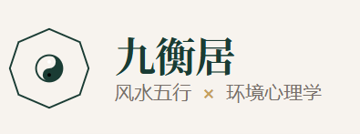

```

```

<div align="center">
  
</div>

# 九衡居 - 智能建筑风水分析平台

## 📖 项目简介

**九衡居**是一款融合传统风水五行与现代环境心理学的智能建筑分析平台。通过AI技术，用户可以上传户型图，获得专业的风水分析报告和优化建议。

### 🌐 在线访问

- **演示地址**: https://fengshui-frontend-ganp.onrender.com

###  演示效果


### ✨ 核心特色

- 🏠 **智能户型分析** - 上传户型图，AI自动识别空间布局
- ☯️ **风水五行解读** - 结合九宫八卦、五行理论进行专业分析
- 🧠 **环境心理学** - 融入现代环境心理学原理
- 🎨 **可视化报告** - 图文并茂的详细分析报告
- 📱 **跨平台使用** - 支持Web端，随时随地使用
- 💳 **灵活付费** - 基础功能免费，高级功能按需付费

## 🚀 技术栈

### 前端

- **React 19** - 现代化UI框架
- **TypeScript** - 类型安全的开发体验
- **Vite 6** - 快速的开发构建工具
- **Tailwind CSS 4** - 实用的样式框架
- **Motion** - 流畅的动画效果
- **React Router** - 页面路由管理

### 后端

- **Express** - Node.js Web框架
- **Supabase** - 后端即服务平台（数据库 + 认证）
- **Stripe** - 支付处理

### AI 服务

- **豆包 AI (Doubao)** - 户型图分析与图像生成
- **通义千问 (Qwen)** - 文本分析处理

## 📋 功能模块

### 1. 户型分析

- 支持 JPG/PNG/WebP 格式图片上传
- AI自动识别户型结构和空间分区
- 九宫八卦方位测算
- 五行能量流转分析

### 2. 风水解读

- 整体评分（1-100分）
- 空间布局优化建议
- 五行元素平衡分析
- 化解方案推荐

### 3. 环境心理学

- 动线设计评估
- 采光通风分析
- 空间功能分区建议
- 居住舒适度提升

### 4. 用户系统

- Supabase 邮箱注册登录
- 分析历史记录
- 个人数据云端同步
- 会员特权管理

## 🛠️ 快速开始

### 环境要求

- Node.js 18+
- npm 或 yarn 包管理器

### 安装步骤

1. **克隆项目**

```bash
git clone <repository-url>
cd 建筑风水
```

2. **安装依赖**

```bash
npm install
```

3. **配置环境变量**

复制 `.env.local.example` 到 `.env.local` 并填写必要的环境变量：

```bash
cp .env.local.example .env.local
```

需要配置的环境变量：

```env
# 豆包 AI API（必填）
VITE_DOUBAO_API_KEY=your_doubao_api_key

# Supabase 数据库（可选）
VITE_SUPABASE_URL=your_supabase_url
VITE_SUPABASE_ANON_KEY=your_supabase_anon_key

# Stripe 支付（可选）
VITE_STRIPE_PUBLISHABLE_KEY=your_stripe_key
```

4. **启动开发服务器**

```bash
npm run dev
```

访问 http://localhost:3000 即可使用

### 数据库设置（可选）

如果需要用户认证和数据持久化功能：

1. 在 Supabase 创建项目
2. 在 Supabase 控制台 SQL Editor 中执行 `supabase-init.sql`
3. 配置环境变量中的 Supabase URL 和 Key

详细步骤请参考 [DATABASE-GUIDE.md](DATABASE-GUIDE.md)

## 📁 项目结构

```
建筑风水/
├── src/                    # 前端源代码
│   ├── api/               # API调用模块
│   ├── components/        # React组件
│   ├── pages/            # 页面组件
│   ├── App.tsx           # 主应用组件
│   └── main.tsx          # 入口文件
├── api/                   # 后端API
│   ├── analyze.ts        # 分析API
│   └── generate-image.ts # 图片生成API
├── lib/                   # 工具库
│   ├── supabase.ts       # Supabase客户端
│   └── stripe.ts         # Stripe配置
├── public/               # 静态资源
└── server.ts             # Express服务器
```

## 部署指南

### Vercel 部署

1. 将代码推送到 GitHub
2. 在 Vercel 导入项目
3. 配置环境变量
4. 一键部署

详细步骤请参考 [VERCEL-DEPLOYMENT-GUIDE.md](VERCEL-DEPLOYMENT-GUIDE.md)

### 环境变量清单

| 变量名                      | 说明             | 是否必填 |
| --------------------------- | ---------------- | -------- |
| VITE_DOUBAO_API_KEY         | 豆包AI API密钥   | ✅ 是    |
| VITE_SUPABASE_URL           | Supabase项目URL  | ❌ 否    |
| VITE_SUPABASE_ANON_KEY      | Supabase匿名密钥 | ❌ 否    |
| VITE_STRIPE_PUBLISHABLE_KEY | Stripe公钥       | ❌ 否    |
| STRIPE_SECRET_KEY           | Stripe私钥       | ❌ 否    |

## 📚 文档

- [数据库配置指南](DATABASE-GUIDE.md) - Supabase数据库设置
- [部署检查清单](DEPLOYMENT-CHECKLIST.md) - 部署前的准备工作
- [Vercel部署指南](VERCEL-DEPLOYMENT-GUIDE.md) - Vercel平台部署步骤
- [Stripe集成指南](STRIPE-INTEGRATION-GUIDE.md) - 支付功能配置

## 🔧 开发命令

```bash
# 启动开发服务器
npm run dev

# 启动后端API服务器
npm run api

# 构建生产版本
npm run build

# 预览生产版本
npm run preview

# 类型检查
npm run lint
```

## 使用流程

1. **访问网站** - 打开应用首页
2. **上传户型图** - 点击上传按钮选择户型图片
3. **AI分析** - 系统自动进行多维度分析
4. **查看报告** - 获取详细的分析报告和优化建议
5. **保存记录** - 登录用户可保存分析历史
6. **导出分享** - 支持导出分析报告

## ⚠️ 注意事项

1. **图片要求**

   - 格式：JPG/PNG/WebP
   - 大小：不超过10MB
   - 内容：清晰的户型图或平面图
2. **API限制**

   - 豆包AI API有调用频率限制
   - 图片生成需要较长时间（约30秒）
3. **数据安全**

   - 用户数据通过Supabase加密存储
   - RLS策略确保数据隔离
   - 支持用户自主删除数据

## 🤝 贡献指南

欢迎提交 Issue 和 Pull Request！

1. Fork 项目
2. 创建功能分支 (`git checkout -b feature/AmazingFeature`)
3. 提交更改 (`git commit -m 'Add some AmazingFeature'`)
4. 推送到分支 (`git push origin feature/AmazingFeature`)
5. 开启 Pull Request

## 📄 许可证

本项目仅供学习和研究使用。

## 🙏 致谢

- 豆包AI - 提供强大的图像识别和分析能力
- Supabase - 提供稳定可靠的后端服务
- Stripe - 提供便捷的支付解决方案

---

<div align="center">
  <strong>九衡居</strong> - 让传统智慧与现代科技完美融合
</div>
